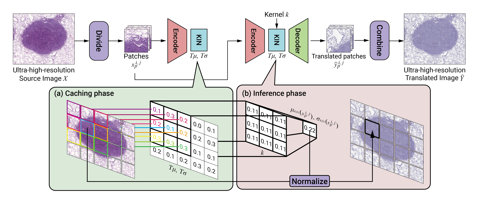
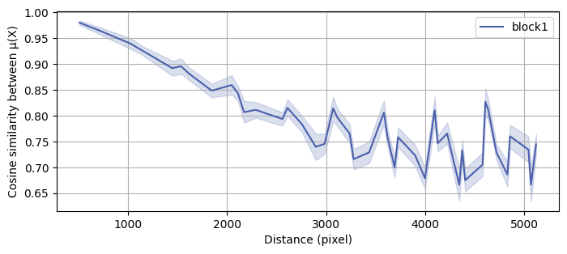
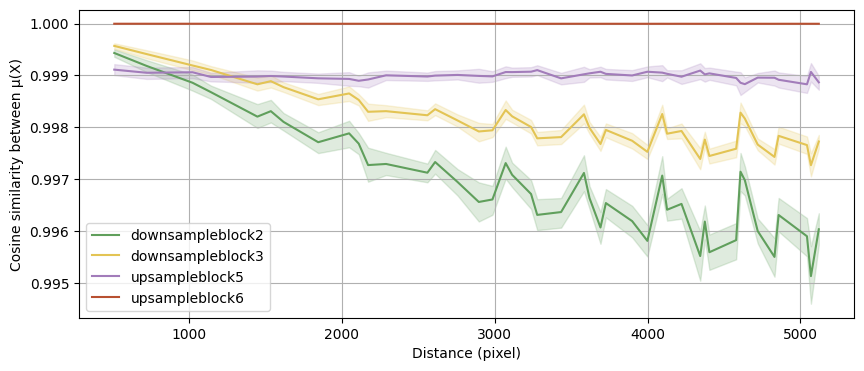

# URUST: Ultra-resolution unpaired stain transformation via Kernelized Instance Normalization (ECCV 2022)
We invented a kernelized instance normalization module enabling ultra-resolution unpaired stain transformation

## Release
We have released [v0](https://github.com/Kaminyou/URUST/releases/tag/v0) that can reproduce experiments mentioned in our paper or be used in your application and study. 
## Environment
- Python 3.8.6
- All the required packages are listed in the `requirements.txt`.

## Quick instruction
A simple example is provided for you here. Or you can jump to the next section to train a model for your own dataset. All the steps here will help you train a model with **CUT** framework.
### Prepare dataset
- [**ANHIR**](https://anhir.grand-challenge.org/Data/)
  * A public dataset [ANHIR](https://anhir.grand-challenge.org/Data/) is used in this project. Please first download it from the offical website and put `ANHIR2019/dataset_medium/breast_1/scale-20pc/HE.jpg` and `ANHIR2019/dataset_medium/breast_1/scale-20pc/ER.jpg` in `data/example/` folder. We would like to transfer `HE (domain X)` to `ER (domain Y)`.
- [**Kyoto_summer2autumn**](https://github.com/Kaminyou/Kyoto-summer2autumn)
  * Due to the lack of dataset consists of high-resolution, we collected and released a dataset named **Kyoto-summer2autumn** to facilitate further studies. Please download this dataset via the following [link](https://github.com/Kaminyou/Kyoto-summer2autumn).

### Take a look at the `config.yaml`
The whole pipeline is heavily dependent on the `config.yaml`. Please take a look at the `./data/example/config.yaml` first to understand what are necessary during training and testing process. You can easily train your own model with your own dataset by modifiying the `config.yaml`.

### Preprocessing
1. It is recommended to manually crop a center part from `HE.jpg` and `ER.jpg` first as the main contents are surrounded by a lot of unnecessary blank region, which will increase the training time but make the distribution hard to be learned. 
2. Assume these two images are cropped and place at `./data/example/HE_cropped.jpg` and `./data/example/ER_cropped.jpg`.
3. Execute the following script to crop patches for training and testing.
```
python3 crop_pipeline.py -c ./data/example/config.yaml
```

### Training
1. Train the model
```script
python3 train.py -c ./data/example/config.yaml
```
2. Wait for the model training
- Some transfered examples will be generated during training. Please check the `./experiments/example_CUT/train/` folder.

### Inference
As the testing data have been cropped during the first step, we can skip this step here.
```
python3 transfer.py -c config_example.yaml --skip_cropping
```
The output will be in the `./experiments/example_CUT/test/HE_cropped/` folder.
The following is an example of output file structure.
```
experiments/
└── example_CUT
    ├── test
    │   └── HE_cropped
    │       ├── combined_in_30.png
    │       ├── combined_kin_30_constant_5.png
    │       ├── combined_tin_30.png
    │       ├── in
    │       │   └── 30
    │       ├── kin
    │       │   └── 30
    │       │       └── constant_5
    │       └── tin
    │           └── 30
    └── train
```
## Train your own model with your own dataset
1. Create a folder in `./data/`
2. Put a `config.yaml` in `./data/$your_folder/`
3. Modify `config.yaml`
4. Prepare images (domain X) and images in (domain Y) in `./data/$your_folder/`.
5. Crop those images into patches.
- If there is only one image in each domain
```
python3 crop_pipeline.py -c ./data/$your_folder/config.yaml
```
- **Multiple images belong to one domain:** you should use `crop.py` to crop each image and save those patches in the same folder (`trainX`, `trainY`)
```
python3 crop.py -i ./data/$your_folder/$image_a -o ./data/$your_folder/trainX/ --thumbnail_output ./data/$your_folder/trainX/
python3 crop.py -i ./data/$your_folder/$image_b -o ./data/$your_folder/trainX/ --thumbnail_output ./data/$your_folder/trainX/
...
```
- **Multiple images belong to one domain:** for the testing data, it is recommended to seperate patches belong to different image in different folder.
```
python3 crop.py -i ./data/$your_folder/$test_a -o ./data/$your_folder/$test_a/ --stride 512 --thumbnail_output ./data/example/$test_a/
python3 crop.py -i ./data/$your_folder/$test_b -o ./data/$your_folder/$test_b/ --stride 512 --thumbnail_output ./data/example/$test_b/
...
```
6. Modify `TRAINING_SETTING` section in `./data/$your_folder/config.yaml`, especially the `TRAIN_DIR_X` and `TRAIN_DIR_Y`.
7. Train the model
```
python3 train.py -c ./data/$your_folder/config.yaml
```
8. Inference
- **If you have only one image requires inference:** modify `INFERENCE_SETTING` section in `./data/$your_folder/config.yaml`, especially the `TEST_X` and `TEST_DIR_X`. Then,
```
python3 transfer.py -c ./data/$your_folder/config.yaml --skip_cropping
```
- **If you have only many images requires inference:** assume you have finishing cropping each testing image in separated folder. Please modify `TEST_X` and `TEST_DIR_X` in the `INFERENCE_SETTING` section and execute the following script for each image.
```
python3 transfer.py -c ./data/$your_folder/config.yaml --skip_cropping
```
## Inference options
Besides `kernelized instance normalization`, `thumbnail instance normalization` and `instance normalization` are also provided.
### Kernelized instance normalization
You can adjust `KIN_PADDING` and `KIN_KERNEL` for inference.
```yaml
INFERENCE_SETTING:
  ...
  NORMALIZATION: "kin"
  KIN_PADDING: 3 # for kin
  KIN_KERNEL: "constant" #constant or gaussian
```
### Thumbnail instance normalization
Please provide the path of the `THUMBNAIL`.
```yaml
INFERENCE_SETTING:
  ...
  NORMALIZATION: "tin"
  THUMBNAIL: "./data/example/testX/thumbnail.png"
```
### Instance normalization
Specification of `NORMALIZATION: in` is enough.
```yaml
INFERENCE_SETTING:
  ...
  NORMALIZATION: "in"
```
## Training framework options
Besides `CUT`, `LSeSim` and `CycleGAN` are also provided. For each experiment, you should rename `EXPERIMENT_NAME` to avoid overwritting.
### CUT
Has been described above.
```yaml
MODEL_NAME: "CUT"
```
### CycleGAN
Specify in the `config.yaml`.
```yaml
MODEL_NAME: "cycleGAN"
```
### LSeSim
Please use `F-LSeSim`, which is subtly modifed from the offical implementation.
1. Training and testing data can be prepared in the current `./data/` where you might have already created during training other models. Duplicated work is not required.
2. Modify your `config.yaml`. Please set `Augment` to `True` for `L-LSeSim` or `False` for `F-LSeSim`. 
```yaml
MODEL_NAME: "LSeSim"
...
TRAINING_SETTING:
  Augment: True #LSeSim
```
3. Modify data path in the `config.yaml`, including `EXPERIMENT_ROOT_PATH`, `TRAINING_SETTING::TRAIN_ROOT`, `TRAINING_SETTING::TRAIN_DIR_X`, `TRAINING_SETTING::TRAIN_DIR_Y`,
`INFERENCE_SETTING::TEST_X`,
`INFERENCE_SETTING::TEST_DIR_X`, and `INFERENCE_SETTING::THUMBNAIL`.<br> *It is recommended to use absolute path to avoid any modification when change to different frameworks.*
```yaml
# Example 1
EXPERIMENT_ROOT_PATH: "./experiments/" 
# Change to
EXPERIMENT_ROOT_PATH: "../experiments/" 

# Example 2
TRAINING_SETTING:
  TRAIN_ROOT: "./data/example/"
# Change to
TRAINING_SETTING:
  TRAIN_ROOT: "../data/example/"
```
4. Move to `./F-LSeSim`.
```
cd ./F-LSeSim
```
5. Run script
```script
./scripts/train_sc.sh $path_to_yaml
```
- e.g.
```script
./scripts/train_sc.sh ./../data/example/config.yaml
```
- Then the model weights and generated samples will be in `./F-LSeSim/checkpoints/$EXPERIMENT_NAME`
6. Inference
```script
./scripts/transfer_sc.sh $path_to_yaml
```
- e.g.
```script
./scripts/transfer_sc.sh ./../data/example/config.yaml
```
- The generated images will be in `./experiments/$EXPERIMENT_NAME`


## Metrics
### 1. Human evaluation study
We open-source the [web server](https://github.com/Kaminyou/Computer-Vision-Research-Human-Evaluation-Server) for human evaluation study. Researchers can easily modify the config to conduct their human evaluation study.
### 2. Comparison between two distributions (WITH REFERENCE)
Given two folders `pathA` and `pathB` that store the original and generated images within the same domain, following metrics will be calculated. 
- FID
```
python3 metric_images_with_ref.py --path-A $pathA --path-B $pathB
```
**If images are stored in multiple folders, please concatenate those paths with delimiters of `,`**.
```
python3 metric_images_with_ref.py --path-A $pathA1,$pathA2,... --path-B $pathB1,$pathB2,...
```
### 3. For two whole images (WITH REFERENCE)
- Histogram correlation
```
python3 metric_whole_image_with_ref.py --image_A_path $path_to_ref_image --image_B_path $path_to_compared_image
```
### 4. For single whole image (NO REFERENCE)
Please refer to the implementation of `NIQE` and `PIQE` calcuations in this [repo](https://github.com/buyizhiyou/NRVQA).
- Sobel gradient
- NIQE
- PIQE

```
python3 metric_whole_image_no_ref.py --path $image_path
```
## Prove of concept
Script has been provided to visualize the relationship between thumbnail's features and patches' features, which shows that the concept using the same mean and variance calcuated from the thumbnail is incorrect and patches nearby each other share similar features.


Please specify the image that would be tested in the `inference` part of `config.yaml`. Then:
```
python3 appendix/proof_of_concept.py -c $path_to_config_file
```
Generated images would be saved in `./proof_of_concept/`
 

## Acknowledgement
Besides our novel kernelized instance normalizatio module, we use [CycleGAN](https://arxiv.org/abs/1703.10593), [Contrastive Unpaired Translation (CUT)](https://link.springer.com/chapter/10.1007/978-3-030-58545-7_19) as our backbone, and [LSeSim](https://arxiv.org/abs/2104.00854). For the CUT model, please refer to the official implementation [here](https://github.com/taesungp/contrastive-unpaired-translation). This code is a simplified version revised from [wilbertcaine's implementation](https://github.com/wilbertcaine/CUT).